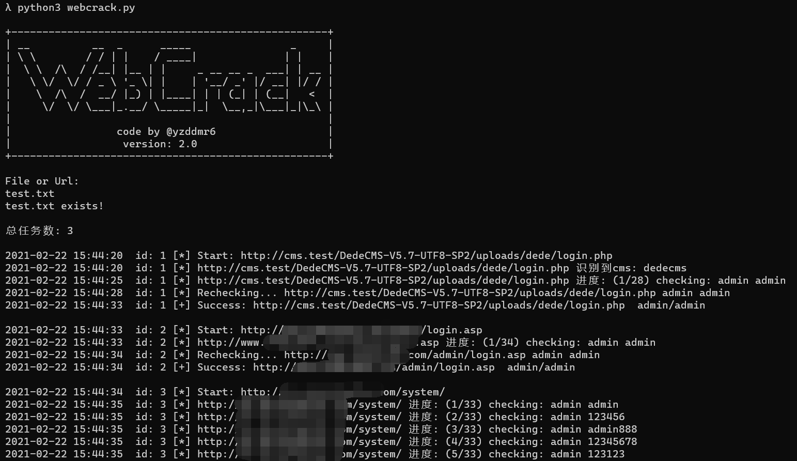

# WebCrack `v(2.2)`

## 工具简介

WebCrack是一款web后台弱口令/万能密码批量检测工具，在工具中导入后台地址即可进行自动化检测。


## 开发文档

https://yzddmr6.com/posts/webcrack-release/

## 更新日志

### 2021/07/27 `v(2.2)`

* 修复后台页面没有action字段导致的解析问题

* 配置文件字典改为加载txt方式

### 2021/03/15 `v(2.1)`

* 修复目标为IP时字典生成失败的BUG

### 2021/02/22 `v(2.0)`

* 代码重构，解耦，面向对象

* `conf/config.py`中可以自定义全局参数

* 去掉预请求，优化核心判断逻辑

* 修复部分BUG

### 2020/02/25 `v(1.1)`

代码准备全部重构，先发一个修复BUG的临时版本

* 优化核心判断逻辑

* 修复两处表单识别问题

* 增加黑名单关键字

### 2019/09/09 `v(1.0)`

* 项目开源

## 工具特点

* 多重判断机制，减少误报

* 随机UA 随机X-Forwarded-For 随机Client-IP

* 可以通过域名生成动态字典

* 可以检测万能密码漏洞

* 支持自定义爆破规则

## 使用方法

下载项目
```
git clone https://github.com/yzddmr6/WebCrack
```

安装依赖
```
pip install -r requirements.txt
```

运行脚本
```
> python3 webcrack.py

+---------------------------------------------------+
| __          __  _      _____                _     |
| \ \        / / | |    / ____|              | |    |
|  \ \  /\  / /__| |__ | |     _ __ __ _  ___| | __ |
|   \ \/  \/ / _ \ '_ \| |    | '__/ _' |/ __| |/ / |
|    \  /\  /  __/ |_) | |____| | | (_| | (__|   <  |
|     \/  \/ \___|_.__/ \_____|_|  \__,_|\___|_|\_\ |
|                                                   |
|                 code by @yzddmr6                  |
|                  version: 2.1                     |
+---------------------------------------------------+

File or Url:

```

输入文件名则进行批量爆破，输入URL则进行单域名爆破。

开始爆破




爆破的结果会保存在`logs/{date}/`文件夹中


## 自定义配置文件

参数详情见`conf/config.py`文件注释

## 警告！

**请勿用于非法用途！否则自行承担一切后果**
